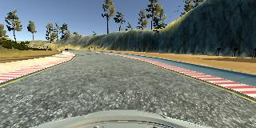
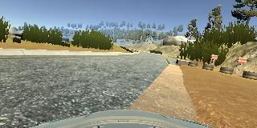
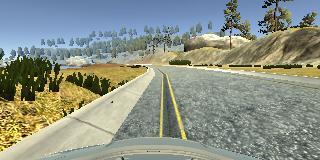
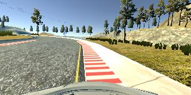
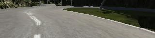
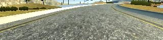
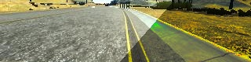
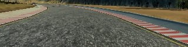

#**Behavioral Cloning** 

## Rubric Points

### Files Submitted & Code Quality

#### 1. Submission includes all required files and can be used to run the simulator in autonomous mode

My project includes the following files:
* model.py containing the script to train the model
* drive.py for driving the car in autonomous mode
* model.h5 containing a trained convolution neural network
* writeup_report.pdf summarizing the results
* nvidia_model.md containing the code of the final model used (only the layers code) used by model.py

I used other files as well, which are included in the repository. 

#### 2. Submission includes functional code
Using the Udacity provided simulator and my drive.py file, the car can be driven autonomously around the track by executing 
```sh
python drive.py model.h5
```

#### 3. Submission code is usable and readable

The model.py file is a tool script that executes code in other files that include only the code for the layers of a Keras model, from the first layer to the layer before the prediction layer. The file `get_data.py` includes several functions to load and prepare the data, including augmentation. The code there is used by `model.py`.

```sh
python model.py -e #epochs -flip #percentile_of_data 
    -brightness #percentile_of_data -shadow #percentile_of_data
    -model nvidia_model.py -mem /path/to/recorded/data/*

python model.py -e 25 -flip 0.33 -brightness 0.33 -shadow 0.33 
    -model nvidia_model.py -mem driving_data/*
```

The argument `-flip` specifies the fraction of the input data that will be randomly sampled
to be flipped (and augment the dataset). `-brightness` and `-shadow` do the same but add
random brightness and random shadows, respectevely.

The code in `nvidia_model.py` is:
```python
normalize = lambda pix: pix / 255.0 - 0.5
x = Lambda(normalize, input_shape=im_shape)(x)  # normalize

x = Conv2D(filters=24, kernel_size=(5,5), strides=(2,2), activation='relu')(x)
x = Conv2D(filters=36, kernel_size=(5,5), strides=(2,2), activation='relu')(x)
x = Conv2D(filters=48, kernel_size=(5,5), strides=(2,2), activation='relu')(x)
x = Conv2D(filters=64, kernel_size=(3,3), activation='relu')(x)
x = Conv2D(filters=64, kernel_size=(3,3), activation='relu')(x)

x = Flatten()(x)

x = Dense(1164, activation='relu')(x)
x = Dense(100, activation='relu')(x)
x = Dense(10, activation='relu')(x)
```

After the last layer displayed above `x = Dense(10, activation='relu')(x)`, there is still the final output layer of the model `x = Dense(1)(x)`, in `model.py`.

The code in `drive.py` was altered to perform the same cropping done in the preprocessing (`image_array = crop(image_array, 0.35, 0.15` in line 74). The cropping function is defined in line 51.

### Model Architecture and Training Strategy

#### 1. An appropriate model architecture has been employed

I used the NVIDIA architecture with RELUs for nonlinearities. I did tweak the model, since it worked well. Most of my work was on collecting, augmenting and selecting the data.

The model has 5 convolutional layers. Instead of pooling layers, the first 3 convolutions have a stride of 2 (both horizontally and vertically) and the filter size increases throughout (24, 36, 48). These convolutions have a 5x5 kernel. The last 2 convolutions have a filter size of 64, no strides and a kernel size of 3x3.

After flattening, the model has 4 fully connected layers with 1164, 100, 10 and 1 neurons. All layers (including the convolutional layers) are activated with RELUs, except the output layer, naturally.


#### 2. Attempts to reduce overfitting in the model

The model itself does not include anything to reduce overfitting as I did not observe that to be a problem. However, I divided the data on several "bins", each corresponding to a steering angle interval. I then limited the amount of samples in any interval to 1000 (code in `select_data` function in `get_data.py`). This inhibits the model to be biased to just go forward.


#### 3. Model parameter tuning

The model used an adam optimizer, so the learning rate was not tuned manually (`model.py` line 56).

#### 4. Appropriate training data

I also collected data in different conditions. I drove one lap both clockwise and anticlock wise in the normal track and nother lap on the hard track. For these datasets, I tried to drive as much as possible with the car centered on the road. I also collected data for special circunstances, e.g. when the car gets on top of lane markings, dirt, grass, etc.

I did not want to drive many laps because I did not want the model to learn a track.

### Architecture and Training Documentation

#### 1. Solution Design Approach

In order to gauge how well the model was working, I split my image and steering angle data into a training and validation set.
I started off with the LeNet architecture.
From there I worked on the data itself for a while, but it soon became apparent that I needed a more powerful model, as the validation loss was not improving.

I chose to switch to the NVIDIA model, presented in class, since it had proven itself in the real world on the same task. This alone made a huge difference.

The car drove mostly fine, except for a couple of spots on the test track.
From there, I worked only on the data: augmenting it further, playing with the cropping thresholds, reducing bias in the data.
For some time I had a deviation of 0.04 (1º) for the right and left cameras, which I found was very conservative.
I observed an increase in driving performance after I increased this to 0.2 (5º) - the car kept closer to the center of the road most of the time.

I noticed that when I recuded the going forward bias of the dataset, the model took long to have a validation loss below 0.01.
I also noticed that when I introduced data from the challenge track, the performance on the test track decreased on a "normal run".
I manually put the car on tricky situations to test is out, and in the end it was more robust.
Tricky situations include putting the car on the road ledges, facing outward on curves.

At the end of the process, the vehicle is able to drive autonomously around the track without leaving the road.
The final dataset used did not cut on the amount of samples going forward, as I found the car had less of a tendency to much closer to the lane markings that way.

#### 2. Final Model Architecture

The final model architecture (`nvidia_model.py`) has been described in point 1 of Model Architecture and Training Strategy.

#### 3. Creation of the Training Set & Training Process

To capture good driving behavior, I first recorded two laps on track one (1 clockwise and 1 anticlockwise) using center lane driving. Here is an example image of center lane driving:



I then recorded the vehicle recovering from the left side and right sides of the road back to center so that the vehicle would learn return to the center of the lane. Before collecting these data, the car had a much bigger tendency to just go forward. These images show what a recovery looks like starting from the sides of the road on different conditions:








Then I repeated this process on track two in order to get more data points. Here, however, I only did one lap and collected recover data only on some parts of the road.

To augment the data sat, I used the side cameras with a 5º deviation thinking that this would mitigate overfitting and increase model robustness. I cropped the top 35% and bottom 15% of the images. For example, here is an image that has then been flipped and another from the left camera. 



These augmentation and preprocessing was the baseline for my dataset. Afterwards I flipped
a fraction of the data.




I also added random brightness and random shadows to fractions of the data.
Only one transformation (flipping, brightness or shadow) was applied to any one image at a
time.






Briefly, I start with a 300% increase of the input data (using all cameras) followed by a 3 x 33% increase (33% for each of the transformations: flip, brightness, shadow), for a total of ~600% over the original number of samples.
After the augmentation process, I had 60891 samples. The images were normalized before being fed to the model.

The data was randomly shuffled and and split 80/20% (training / validation).

I used this training data for training the model. The validation set helped determine if the model was over or under fitting. Since I saved the model at the end of each epoch, I usually ran the model for 20-30 epochs and picked the epoch that seemed most promising (low validation loss but I was attentive to not pick an epoch where the validation loss hadn't change much for some time). Usually I used the model form epoch 12-14. On some of the tweaks to the dataset, I would pick a model from a later epoch since it took longer to converge low loss. I used an adam optimizer so that manually training the learning rate wasn't necessary.